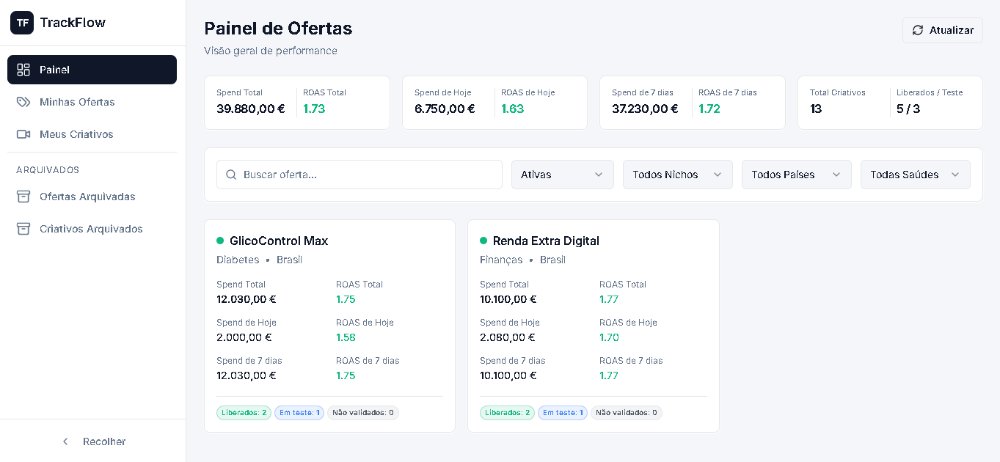
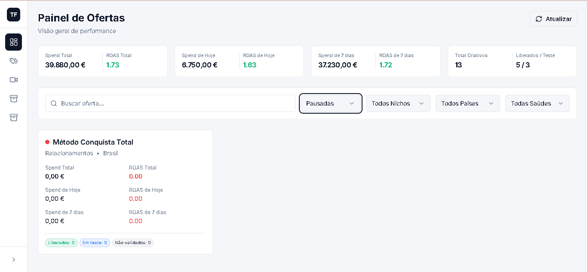
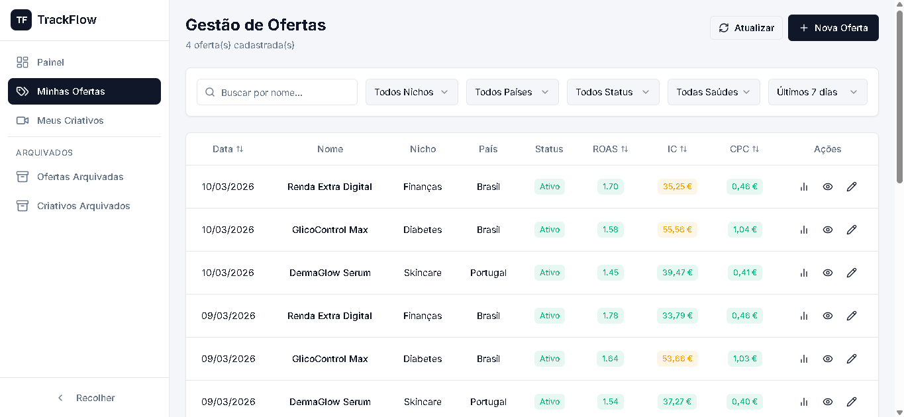
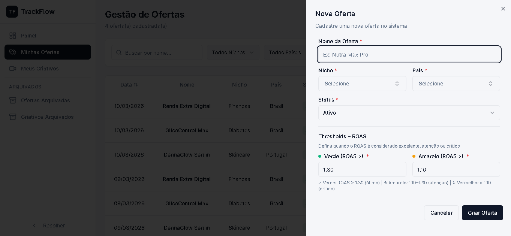
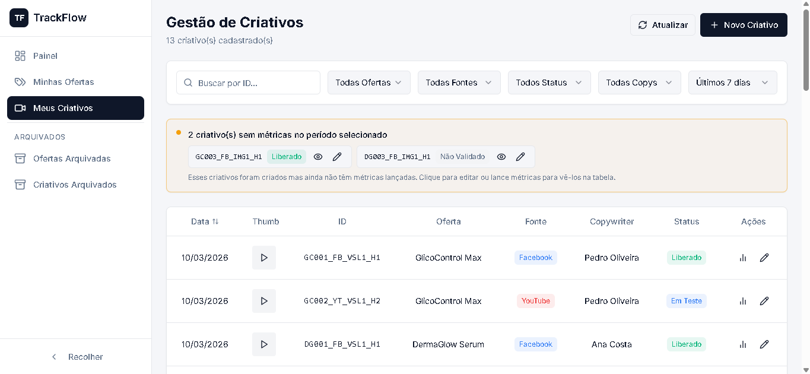
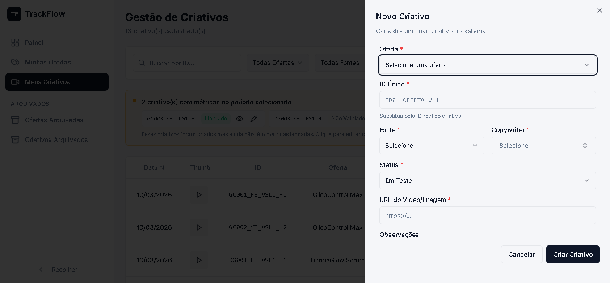
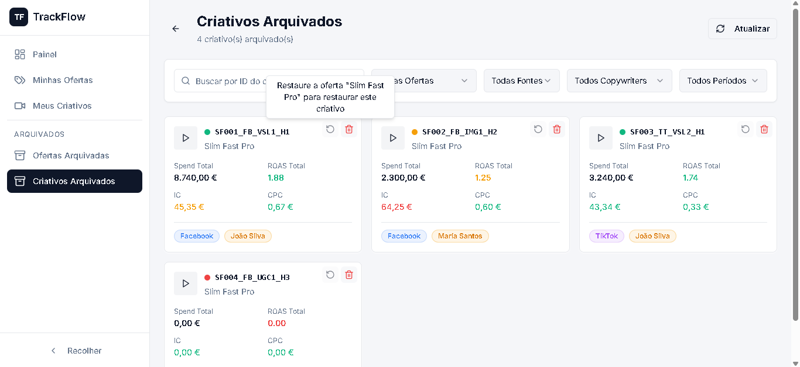
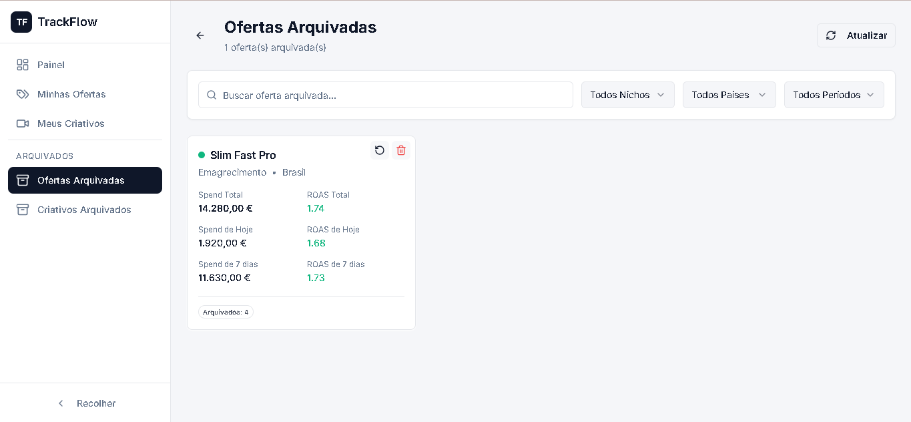
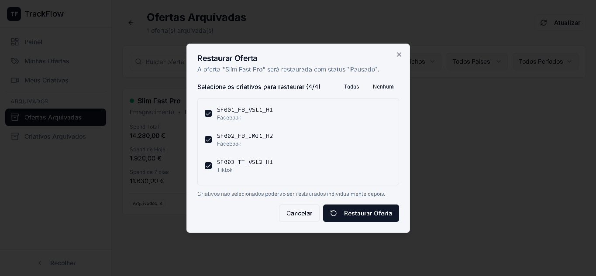
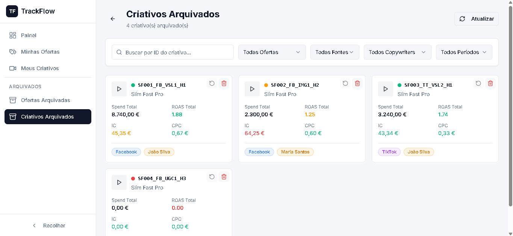

# TrackFlow - Ad Insights Hub

Sistema de tracking de performance de campanhas de anúncios. Permite gerenciar ofertas, criativos e métricas diárias com dashboards visuais, sistema de thresholds com cores (verde/amarelo/vermelho) e histórico completo.

> **Checklist de desenvolvimento**: Veja o progresso e próximos passos no arquivo [CHECKLIST.md](./CHECKLIST.md).

---

## Screenshots

### Dashboard - Ofertas Ativas


### Dashboard - Filtro por Status


### Gestão de Ofertas


### Adicionar Nova Oferta


### Gestão de Criativos


### Adicionar Novo Criativo


### Alerta de Demonstração


### Ofertas Arquivadas


### Restauração de Oferta Arquivada


### Criativos Arquivados


---

## Conceitos do Sistema

O TrackFlow trabalha com 3 entidades principais em hierarquia:

```
Oferta (campanha)
  └── Criativo (anúncio vinculado a uma oferta)
        └── Métrica Diária (números de performance de um dia)
```

- **Oferta**: Uma campanha de ads. Tem nome, nicho, país e thresholds de performance.
- **Criativo**: Um anúncio específico (vídeo) vinculado a uma oferta. Tem ID único, fonte (Facebook/YouTube/TikTok), copywriter responsável e URL do vídeo.
- **Métrica Diária**: Os números de um criativo num dia específico: spend, faturado, impressões, cliques e conversões. A partir deles o sistema calcula ROAS, IC, CPC, CTR e CPM.

As métricas da oferta são calculadas automaticamente pelo banco de dados somando as métricas de todos os criativos daquela oferta no mesmo dia.

---

## Banco de Dados

### Diagrama de Relações

```
ofertas (1) ──────── (N) criativos (1) ──────── (N) metricas_diarias
   │                                                       │
   │                                                       │ (trigger automático)
   │                                                       ▼
   └──────────────── (N) metricas_diarias_oferta    (soma automática por oferta/dia)

ofertas (1) ──────── (N) ofertas_thresholds_historico

nichos, paises, copywriters  (listas auxiliares)
```

Quando você lança uma métrica num criativo, o banco automaticamente recalcula a métrica agregada da oferta naquele dia. Não é necessário fazer isso manualmente.

---

## Sistema de Cores (Thresholds)

O sistema de cores é o coração do TrackFlow. Cada oferta tem limites de performance configurados para 3 métricas:

### Como funciona

| Métrica | Lógica | Verde | Amarelo | Vermelho |
|---------|--------|-------|---------|----------|
| **ROAS** | Maior = Melhor | Acima do limite verde | Entre amarelo e verde | Abaixo do amarelo |
| **IC** (custo por conversão) | Menor = Melhor | Abaixo do limite verde | Entre verde e amarelo | Acima do amarelo |
| **CPC** (custo por clique) | Menor = Melhor | Abaixo do limite verde | Entre verde e amarelo | Acima do amarelo |

**Exemplo prático**: Se uma oferta tem ROAS verde=1.3 e amarelo=1.1:
- ROAS de 1.5 aparece em **verde** (ótimo, acima de 1.3)
- ROAS de 1.2 aparece em **amarelo** (atenção, entre 1.1 e 1.3)
- ROAS de 0.9 aparece em **vermelho** (problema, abaixo de 1.1)

### Onde as cores aparecem

- **Dashboard**: bolinha colorida no canto do card de cada oferta (baseada no ROAS total)
- **Tabelas de métricas**: colunas ROAS, IC e CPC ficam coloridas em todas as telas
- **Criativos Arquivados**: histórico de métricas também respeita as cores

### Valores padrão

Se você não definir thresholds ao criar uma oferta, o sistema usa:
- ROAS: verde >= 1.3, amarelo >= 1.1
- IC: verde <= 50, amarelo <= 60
- CPC: verde <= 1.5, amarelo <= 2.0

### Histórico de thresholds

Quando você altera os thresholds de uma oferta, o sistema guarda o histórico. Métricas de dias passados são coloridas com os thresholds que valiam naquele dia, não com os atuais. Isso garante que a análise histórica seja fiel.

---

## Telas e Funcionalidades

### 1. Painel de Ofertas (Dashboard) — `/`

Tela inicial com a visão geral de tudo.

**No topo**: 4 cards de KPI mostrando os totais do sistema:
- Spend Total e ROAS Total (histórico completo)
- Spend de Hoje e ROAS de Hoje
- Spend dos últimos 7 dias e ROAS dos últimos 7 dias
- Total de criativos e quantos estão Liberados vs Em Teste

**No centro**: Grid de cards, um para cada oferta. Cada card mostra:
- Nome, nicho e país da oferta
- Bolinha de saúde (verde/amarela/vermelha baseada no ROAS total)
- Spend e ROAS nos 3 períodos (total, hoje, 7 dias)
- Quantidade de criativos por status (liberados, em teste, não validados)

**Filtros disponíveis**:
- Busca por nome
- Status (ativo ou pausado)
- Nicho
- País
- Saúde (só verde, só amarelo ou só vermelho)

**O que dá pra fazer**:
- Clicar num card leva para a tela de detalhes da oferta
- Botão de refresh recarrega todos os dados

---

### 2. Gestão de Ofertas — `/ofertas`

Tela principal para gerenciar ofertas e ver métricas diárias.

**Tabela de métricas**: Mostra uma linha para cada dia de cada oferta com as colunas Data, Nome, Nicho, País, Status, ROAS, IC, CPC e Ações. As colunas ROAS, IC e CPC são coloridas pelos thresholds. É possível ordenar clicando nos headers de Data, ROAS, IC ou CPC.

**Filtros**: Busca por nome, nicho, país, status, saúde e período (hoje, 7 dias, 30 dias, customizado ou todos).

**Alerta de ofertas sem métricas**: Se existem ofertas ativas que não têm métricas no período selecionado, aparece um alerta amarelo listando quais são. Útil para identificar ofertas que não estão sendo acompanhadas.

**Ações na tabela** (coluna da direita):
- Ícone de cifrão ($): abre um popover mostrando Lucro, Margem de Contribuição, Faturamento e Spend daquele dia
- Ícone de olho: abre o dialog de thresholds para ver as métricas esperadas daquela oferta
- Ícone de lápis: abre o formulário de edição

#### Criar uma oferta

Clicar em "Nova Oferta" abre um formulário lateral com:
- **Nome** (obrigatório)
- **Nicho** (obrigatório) — pode selecionar existente ou criar novo digitando
- **País** (obrigatório) — pode selecionar existente ou criar novo digitando
- **Status** — ativo ou pausado
- **Thresholds iniciais** — valores de verde e amarelo para ROAS, IC e CPC. Um texto explicativo mostra como cada faixa funciona

Ao salvar, a oferta é criada e os thresholds são registrados no histórico.

#### Editar uma oferta

Clicar no ícone de lápis abre o formulário de edição com os dados atuais. Ao salvar:
1. O sistema mostra um dialog de confirmação listando exatamente o que vai mudar
2. Você confirma ou cancela

**Caso especial — mudar status para "arquivado"**: Se você mudar o status de uma oferta para arquivado, ela será arquivada em cascata. Isso significa que todos os criativos vinculados que não estejam já arquivados também serão arquivados automaticamente.

#### Editar thresholds

Thresholds não são editados no formulário da oferta. Para editá-los:
1. Clicar no ícone de olho na tabela (ou no botão "Métricas Esperadas" na tela de detalhes)
2. No dialog que abre, clicar no ícone de edição
3. Alterar os valores e salvar

Cada alteração é registrada no histórico com a data de vigência.

---

### 3. Detalhes da Oferta — `/ofertas/:id`

Tela dedicada a uma oferta específica com tudo sobre ela.

**KPIs no topo**: Spend Total, ROAS Total, Faturamento e Lucro Líquido. O ROAS fica colorido pelo threshold e o Lucro fica verde (positivo) ou vermelho (negativo).

**4 tabs**:

1. **Resultado Diário**: Tabela com as métricas agregadas da oferta dia a dia — Dia, Faturamento, Spend, ROAS, IC, CPC, Lucro e Margem de Contribuição. Tem filtro de período próprio.

2. **Criativos FB** (Facebook): Tabela com todos os criativos do Facebook vinculados a essa oferta.

3. **Criativos YT** (YouTube): Mesma coisa para YouTube.

4. **Criativos TT** (TikTok): Mesma coisa para TikTok.

**Nas tabs de criativos** você pode:
- Buscar por ID do criativo
- Filtrar por status e copywriter
- Filtrar por período (as métricas mostradas mudam conforme o período: hoje, 3d, 7d, 30d)
- Clicar no ID de um criativo copia ele para a área de transferência
- Clicar em "Lançar Métrica" para registrar métricas novas
- Clicar em "Importar CSV" para importar métricas em lote

**Se a oferta estiver arquivada**: Os botões de lançar métrica e importar CSV ficam ocultos.

---

### 4. Gestão de Criativos — `/criativos`

Tela para gerenciar todos os criativos do sistema, independente da oferta.

**Tabela de métricas**: Uma linha por dia por criativo com colunas Data, Miniatura (thumb do vídeo), ID, Oferta, Fonte (FB/YT/TT), Copywriter, Status e Ações.

**Filtros**: Busca por ID, oferta, fonte, status, copywriter e período.

**Alerta de criativos sem métricas**: Assim como na tela de ofertas, mostra quais criativos ativos não têm métricas no período selecionado.

**Ações na tabela**:
- Clicar no ID copia para clipboard
- Clicar na miniatura abre o player de vídeo (funciona com YouTube, Vimeo e MP4)
- Ícone de cifrão ($): popover com todas as métricas detalhadas (ROAS, IC, CPC, conversões, cliques, impressões, CTR, CPM, spend)
- Ícone de lápis: editar criativo

#### Criar um criativo

Clicar em "Novo Criativo" abre formulário com:
- **Oferta** (obrigatório) — selecionar a oferta dona
- **ID Único** (obrigatório) — identificador do criativo (ex: CR_001)
- **Fonte** (obrigatório) — Facebook, YouTube ou TikTok
- **Copywriter** (obrigatório) — pode selecionar existente ou criar novo
- **Status** (obrigatório) — não validado, em teste, liberado ou pausado
- **URL** (obrigatório) — link do vídeo do criativo
- **Observações** (opcional)

#### Editar um criativo

Abre dialog com os mesmos campos preenchidos. Ao salvar, mostra confirmação com o que vai mudar.

#### Status dos criativos

| Status | Significado |
|--------|-------------|
| Não validado | Recém criado, ainda não foi testado |
| Em teste | Rodando em fase de teste |
| Liberado | Aprovado e rodando em produção |
| Pausado | Temporariamente parado |
| Arquivado | Removido (vai pra lixeira) |

---

### 5. Lançar Métricas

O principal fluxo operacional do sistema. Existem duas formas:

#### Lançamento individual (LancarMetricaDialog)

Wizard de 5 etapas acessado pelo botão "Lançar Métrica" na tela de detalhes da oferta:

**Etapa 1 — Selecionar criativo**: Lista todos os criativos ativos da oferta. Pode buscar por ID e filtrar por fonte.

**Etapa 2 — Confirmar criativo**: Mostra os detalhes do criativo selecionado (oferta, fonte, status) para confirmação.

**Etapa 3 — Selecionar data**: Calendário onde só é possível escolher datas passadas (não futuras). O sistema verifica automaticamente se já existe métrica para aquele criativo naquele dia:
- Se **não existe**: segue para preencher valores novos
- Se **já existe**: mostra os valores atuais e oferece duas opções — "Editar" (altera campos específicos) ou "Criar Nova" (sobrescreve tudo)

**Etapa 4a — Preencher valores** (métrica nova): 5 campos obrigatórios:
- Spend (quanto gastou)
- Faturado (quanto gerou de receita)
- Impressões
- Cliques
- Conversões

**Etapa 4b — Editar existente**: Checkboxes para selecionar quais campos alterar. Mostra o valor atual ao lado para referência.

**Etapa 5 — Revisão**: Preview de tudo antes de salvar. Para métricas novas, mostra também os valores calculados (ROAS, CPC, CTR). Só salva se você confirmar.

#### Importação em lote (CSV)

Acessado pelo botão "Importar CSV" na tela de detalhes da oferta:

1. **Upload**: Arraste um arquivo CSV ou clique para selecionar

2. **Formato do CSV**:
   ```
   id_criativo,data,spend,faturado,impressoes,cliques,conversoes
   CR_001,2026-02-05,150.50,450.00,10000,250,15
   ```

3. **Parsing inteligente**: O sistema aceita variantes de formato:
   - Separador: vírgula (,) ou ponto-e-vírgula (;) — detecta automaticamente
   - Nomes de coluna: aceita variantes (ex: "id", "criativo", "id_criativo" todos funcionam)
   - Datas: aceita YYYY-MM-DD ou DD/MM/YYYY
   - Números: aceita vírgula ou ponto como decimal

4. **Validação**: Cada linha é verificada individualmente:
   - **Verde**: válida e pronta pra importar
   - **Amarelo**: já existe métrica (vai sobrescrever)
   - **Vermelho**: erro (ID não encontrado, data inválida, etc.) — não será importada

5. **Preview**: Tabela com todas as linhas e seus status. Você pode remover linhas antes de importar.

6. **Importar**: Salva todas as linhas válidas de uma vez.

---

### 6. Ofertas Arquivadas — `/ofertas-arquivadas`

Lixeira de ofertas. Mostra todas as ofertas que foram arquivadas.

**Filtros**: Busca por nome, nicho, país e período (filtra pela data em que foi arquivada).

**Para cada oferta arquivada, você pode**:

#### Restaurar

1. Clicar no ícone de restaurar abre um dialog
2. O dialog lista todos os criativos que foram arquivados junto com a oferta
3. Checkbox para selecionar quais criativos restaurar junto — com botões "Selecionar Todos" e "Desmarcar Todos"
4. Ao confirmar:
   - A oferta volta com status **pausado**
   - Os criativos selecionados voltam com status **em teste**
   - Os criativos não selecionados continuam arquivados (como se tivessem sido arquivados individualmente)

#### Deletar permanentemente

1. Clicar no ícone de lixeira abre um dialog de confirmação
2. Você precisa digitar o **nome exato** da oferta para confirmar
3. A deleção é **irreversível** — a oferta é removida do banco de dados

---

### 7. Criativos Arquivados — `/criativos-arquivados`

Lixeira de criativos. Mostra todos os criativos que foram arquivados.

**Filtros**: Busca por ID, oferta, fonte, copywriter e período.

**Clicar num card de criativo**: Abre um dialog com o histórico completo de métricas:
- Resumo: Spend Total, Faturado Total, ROAS Médio, IC Médio, CPC Médio
- Tabela com todas as métricas dia a dia, coloridas pelos thresholds da oferta

**Para cada criativo arquivado, você pode**:

#### Restaurar

- Se o criativo foi arquivado **individualmente**: botão habilitado, volta com status **pausado**
- Se o criativo foi arquivado **junto com a oferta** (arquivamento em cascata): botão **desabilitado** com tooltip explicando que é necessário restaurar a oferta primeiro pela tela de Ofertas Arquivadas

#### Deletar permanentemente

1. Clicar no ícone de lixeira
2. Digitar o **ID único exato** do criativo para confirmar
3. Deleção irreversível

---

## Arquivamento — Como Funciona

### Arquivar uma oferta

Quando você arquiva uma oferta (mudando status para "arquivado"):
1. Todos os criativos vinculados que não estejam já arquivados são marcados como arquivados
2. Todos recebem o **mesmo timestamp** no campo `archived_at`
3. A oferta também recebe esse timestamp

O timestamp compartilhado é a chave do sistema — é assim que o TrackFlow sabe quais criativos foram arquivados junto com a oferta vs quais já estavam arquivados antes.

### Arquivar um criativo individualmente

Quando você arquiva só um criativo, ele recebe seu próprio timestamp. Não afeta a oferta nem outros criativos.

### Restaurar uma oferta

1. Na tela de Ofertas Arquivadas, clicar em restaurar
2. O sistema busca todos os criativos com o mesmo `archived_at` da oferta
3. Você escolhe quais criativos restaurar junto
4. Os não selecionados ganham um novo `archived_at` (ficam independentes na lixeira)
5. A oferta e os selecionados voltam ao sistema

### Restaurar um criativo

- Se foi arquivado sozinho: restaura normalmente
- Se foi arquivado com a oferta: não pode restaurar individualmente — precisa restaurar pela oferta

---

## Filtro de Período

Presente em quase todas as telas. Controla o intervalo de datas das métricas exibidas.

| Opção | O que mostra |
|-------|-------------|
| Hoje | Apenas métricas do dia atual |
| 7 dias | Últimos 7 dias (incluindo hoje) |
| 30 dias | Últimos 30 dias |
| Customizado | Você escolhe data início e fim num calendário |
| Todos | Todo o histórico desde o início |

Na tela de detalhes da oferta, o período também afeta os valores de spend/ROAS mostrados nas tabs de criativos.

---

## Player de Vídeo

Criativos com URL de vídeo mostram uma miniatura clicável. O player suporta:

- **YouTube**: Mostra thumbnail do vídeo. Clicando abre player embutido
- **Vimeo**: Abre player embutido
- **MP4/WebM/MOV**: Abre player HTML5 nativo
- **Outros**: Mostra botão para abrir o link externo

Se o criativo não tem URL, aparece um ícone de play genérico.

---

## Listas Dinâmicas

Nichos, países e copywriters não são listas fixas. Em qualquer formulário onde aparece um desses campos, você pode:

1. Selecionar um valor existente no dropdown
2. **Digitar um novo valor** que não existe — o sistema cria automaticamente e já seleciona

Isso vale para:
- Nicho (na criação/edição de oferta)
- País (na criação/edição de oferta)
- Copywriter (na criação/edição de criativo)

---

## Métricas Calculadas

Você informa 5 valores ao lançar uma métrica. O sistema calcula o resto:

| Você informa | Sistema calcula |
|-------------|----------------|
| Spend | ROAS = Faturado / Spend |
| Faturado | IC = Spend / Conversões |
| Impressões | CPC = Spend / Cliques |
| Cliques | CTR = (Cliques / Impressões) x 100 |
| Conversões | CPM = (Spend / Impressões) x 1000 |

Além disso, para as métricas agregadas da oferta, o banco calcula automaticamente:
- **Lucro** = Faturado - Spend
- **MC** (Margem de Contribuição) = (Lucro / Faturado) x 100

---

## Copiar IDs

Em várias telas, clicar no ID de um criativo copia ele para a área de transferência com uma notificação de confirmação. Útil para buscar em outras ferramentas ou colar em planilhas.
